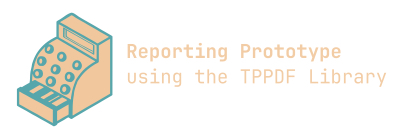

 

---------------

Evaluating the [TPPDF Library](https://github.com/techprimate/TPPDF) to generate account reports in RuKa (Kassensaldo). Either single ReportRecord or all ReportRecords.

- [Documentation TPPDF](https://github.com/techprimate/TPPDF/blob/main/Documentation/Usage.md)

- See defintion of package.swift manifest to add git and adjust dependencies

- [iPadOS Swift Progamming Tools](https://skyaaron.com/posts/swiftpm-app-projects)

- From Working Copy and terminal add to GitHub repo with  private SSH GitHub key.

- [App development on iPad](https://mutatingfunc.github.io/blog/2024-10-12-app-development-on-ipad/)

---------------------

(c) 2025 [Jean-Nicolas Fahrenberg](https://www.fahrenberg.app)
